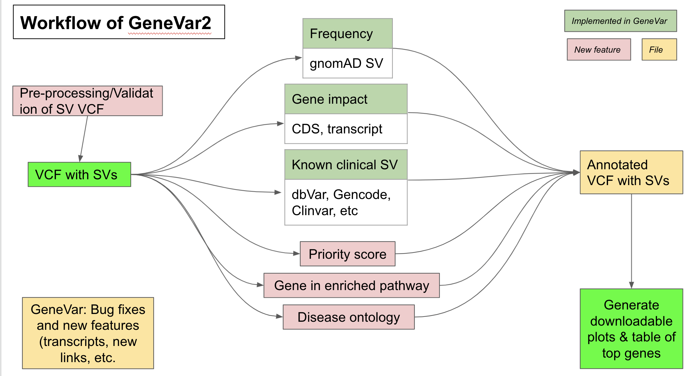

# GeneVar2

Enhancement of GeneVar app

## Contributors

1. Tim Hefferon `(Leader & Liaison)`
2. Ahmad Al Khleifat `(Writer and Guide)`
3. Rupesh Kesharwani `(Sysadmin and code developer)`
4. Divya Kalra `(Sysadmin and code developer)`
5. Kimberly Walker `(Writer)`
6. Priya lakra `(code developer)`
7. Jianzhi(Quentin) `(QC checker)` 
8. Jean Monlong `(Sysadmin and code developer)`

## Goals

GeneVar is an open access, gene centric data browser for SV analysis. GeneVar takes as input a gene name or ID and produces a report that informs the user of all SVs overlapping the gene and any non-coding regulatory elements affecting expression of the gene. Clinical_SV is an open access software that can annotate vcf files with clinically relavant information as well as provide useful visualizations such as disease ontology plots.

GeneVar-2 is the integration of these two apps which work together to facilitate reporting of structural variations data. GeneVar-2 tool is intended to have a clinical focus, informing the interpretation of SV pertaining to a gene name. In addition, GeneVar-2 gives the user the option to upload genotyping data and produces a report, file, and genome browser session that informs the user of all structural variants overlapping the gene, including any non-coding regulatory elements affecting expression of the gene.

## Description

This is a new version of GeneVar, a previously released app. The software will now analyze the user's SV vcf, such as Clinical SV and GeneVar and generates lots of clinically and research relevant results such as genomic structral varinats annotation, Disease Ontology and Enrich pathways based on SV types.

## Overview Diagram

## How it works

Annotate allele frequency

Input:
All dbVar SVs or subset of SVs for one gene (using SV<->gene link computed above).

gnomAD-SV VCF file with allele frequency information

Output:
TSV with at least two columns: variant_id, af.
Only for variants that were matched with the gnomAD-SV data.
Going further: extract frequency in super-populations in column: af_AFR, etc.
Going even further: match SVs from other studies with gnomAD-SV and annotate their frequency
Methods: We might be able to match the dbVar and gnomAD-SV variants by variant ID. Otherwise very stringent overlapping of the two should be able to match the variants. We might need to use the hg19 version to match the original gnomAD-SV data to dbVar variants, and then make the connection to GRCh38 variants from dbVar (by variant ID).

Annotate overlap with clinically-relevant SVs

Input:
All dbVar SVs or subset of SVs for one gene (using SV<->gene link computed above).
ClinGen or pathogenic SVs from ClinVar, etc

Output:
TSV with variant_id and TRUE/FALSE columns about their overlap. E.g. pathogenic_clinvar_sv.
Methods: Use either a simple overlap (any base overlapping) or reciprocal overlap (typically 50%).

Annotate overlap with clinically-relevant SNVs/indels

Input:
All dbVar SVs or subset of SVs for one gene (using SV<->gene link computed above).
ClinGen or pathogenic SNV/indels from ClinVar, etc

Output:
TSV with variant_id and TRUE/FALSE columns about their overlap. E.g. pathogenic_clinvar_sv.
Methods: Use either a simple overlap (any base overlapping) or reciprocal overlap (typically 50%).

## Installation
GeneVar-2 is available on GitHub (https://github.com/collaborativebioinformatics/GeneVar2). The repository provides detailed instructions for tool usage and installation. 

## Quick Start

## Test data

