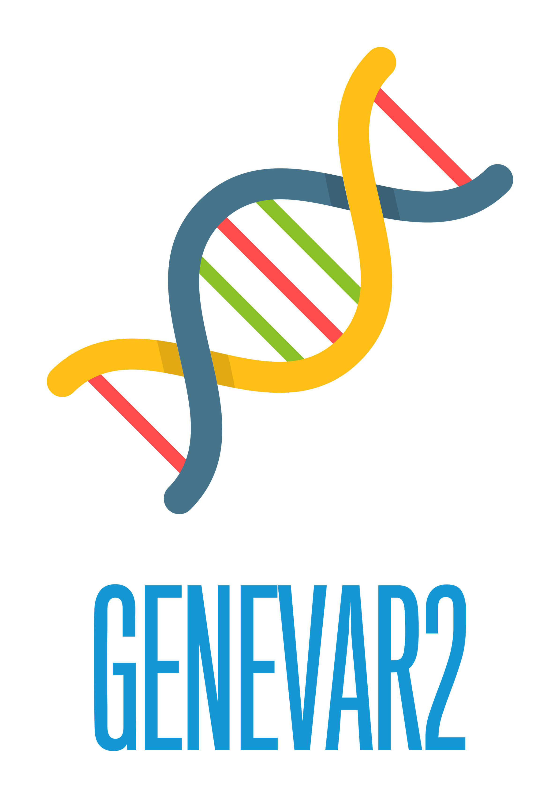

# GeneVar2

Enhancement of GeneVar app

## Contributors

1. Tim Hefferon `(Leader & Liaison)`
2. Ahmad Al Khleifat `(Writer and Guide)`
3. Rupesh Kesharwani `(Sysadmin and code developer)`
4. Divya Kalra `(Sysadmin and code developer)`
5. Kimberly Walker `(Writer)`
6. Priya lakra `(code developer)`
7. Jianzhi/Quentin `(QC checker)` 

## Goals

Integration of two apps (Clinical_SV and GeneVar) that can work together, Eventually enhanced the feature of exisiting GeneVar features.

## Description

This is a new version of GeneVar, a previously released app. The software will now analyze the user's SV vcf, such as Clinical SV and GeneVar and generates lots of clinically and research relevant results such as genomic structral varinats annotation, Disease Ontology and Enrich pathways based on SV types.

## Overview Diagram

## Notes/Documentation

## Installation

## Quick Start

## Test data

