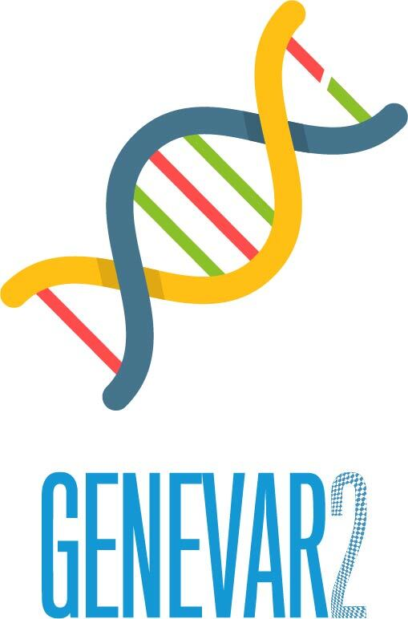
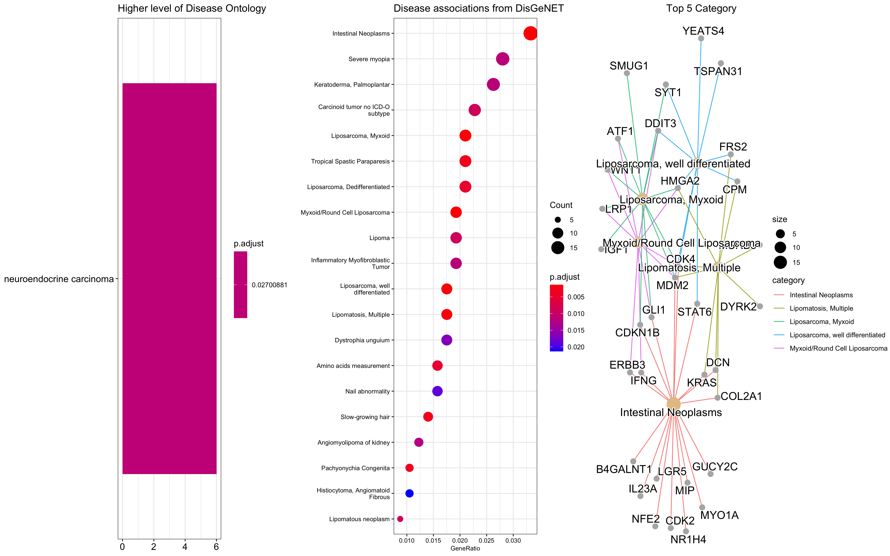
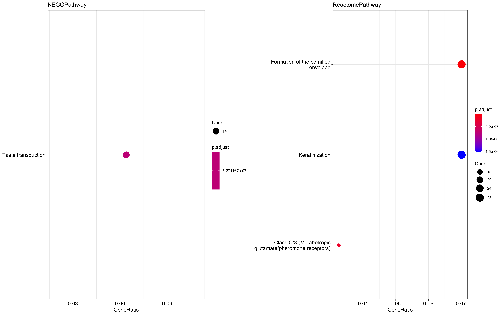

# GeneVar2: Effortless SV annotation and interpretation 




## Contributors

1. Tim Hefferon `(Leader & Liaison)`
2. Ahmad Al Khleifat `(Data Guru and Writer)`
3. Rupesh Kesharwani `(Sysadmin and code developer)`
4. Divya Kalra `(Sysadmin and code developer)`
5. Kimberly Walker `(Writer)`
6. Priya Lakra `(Code developer)`
7. Jianzhi(Quentin) Yang `(QC checker)` 
8. Jean Monlong `(Sysadmin and code developer)`
9. David Henke `(Writer and Guide)`
10. Weiyu Zhou (`App developer`)

## Introduction

Next-generation sequencing provides the ability to sequence extended genomic regions or a whole-genome relatively cheaply and rapidly, making it a powerful technique to uncover the genetic architecture of diseases. However, there remain significant challenges, including interpreting and prioritizing the found variants and setting up the appropriate analysis pipeline to cover the necessary spectrum of genetic factors, including expansions, repeats, insertions/deletions (indels), structural variants and point mutations. For those outside the immediate field of genetics – a group that includes researchers, hospital staff, general practitioners, and, increasingly, patients who have paid to have their genome sequenced privately – the interpretation of findings is particularly challenging. Although various tools are available to predict the pathogenicity of a protein-changing variant, they do not always agree, further compounding the problem. Furthermore, with the increasing availability of next-generation sequencing data, non-specialists, including health care professionals and patients, are obtaining their genomic information without a corresponding ability to analyse and interpret it, as the relevance of novel or existing variants in genes is not always apparent. The same is true of structural variant analysis, the interpretation of which also requires care related to sample and platform selection, quality control, statistical analysis, results prioritisation, and replication strategy. Here we present GeneVar2: an open access, gene-centric data browser to support structural variant analysis.


## Goals

[GeneVar](https://github.com/collaborativebioinformatics/GeneVar) is an open access, gene centric data browser for SV analysis. GeneVar takes as input a gene name or ID and produces a report that informs the user of all SVs overlapping the gene and any non-coding regulatory elements affecting expression of the gene. [Clinical SV](https://github.com/collaborativebioinformatics/clinical_SVs) is an open access software that can annotate vcf files with clinically relavant information as well as provide useful visualizations such as disease ontology plots.

GeneVar2 is the integration of these two apps which work together to facilitate reporting of structural variations data. GeneVar2 tool is intended to have a clinical focus, informing the interpretation of SV pertaining to a gene name. In addition, GeneVar2 gives the user the option to upload genotyping data and produces a report, file, and genome browser session that informs the user of all structural variants overlapping the gene, including any non-coding regulatory elements affecting expression of the gene.


## Description

The aim of this project is to merge the functionality of GeneVar and Clinical_SV into one new application, GeneVar2. GeneVar is a gene centric data browser which is great to review a small list of genes individually for the browser allows for in-depth analysis of SVs that overlap a gene of interest. However, many users will typically have variant caller files (VCFs) as output from analysis pipelines.  To better accomodate this use-case, we are combining GeneVar with Clinical_SV which already encompasses the ability to upload and annotat SV vcfs.  In addition, Clinical_SV produces helpful visualizations of Disease Ontology and enrichment pathway analysis based on SV types.


## Overview Diagram


## How it works

GeneVar2 is a web page application.  Users have two ways of interacting with the tool depending on what their input is.

https://user-images.githubusercontent.com/313712/137163263-185d984b-c716-4b85-a520-2b813ac70f1d.mp4

1) Enter individual genes: After entering the gene name (HGNC, Ensembl gene (ENSG), or transcript (ENST) identifier) in the search box on the homepage, you will be directed to the gene-specific page containing:

    - Gene-level summary with number of SVs, number of clinival SVs or SVs overlapping clinical SNVs.
    - Links to the gene's page on OMIM, GTEx, gnomAD.
    - A dynamic table with the annotated variants overlapping the gene.
    - A graph with the distribution of the allele frequency for variants matched with gnomAD-SV (50% reciprocal overlap).

    The profile of the SV to consider, such as type and size range, can be specified on the side bar. 
    Each column in the dynamic table can be "searched" into or reorder dynamically. 
    All data used by the app will be available for download in tab-delimited files. 
    By default, allele frequency is reported based on gnomAD genomes and exomes.

2) Upload a vcf file: After users upload their own structural variant vcf file, the application will annotate each SV with the following annotation:

   - Allele Frequency: For variants found in gnomAD-SV, allele frequency for available populations will be annotated.
   - ClinVar Information: Pathogenic SVs, SNVs and Indels from ClinVar that overlap with called SVs will be annotated.

In addition a number of tables are provided to download including Disease Ontology details table and Clinical rank table.

Finally, a number of plots are also provided to download including KEGG pathway, Disease Ontology, and Disease associations from DisGeNET.


## Installation and Quick Start
For users interested in annotating their own vcf files without using the web application, the following R scripts are available.  First install the required packages in R.

```r
install.packages("easypackages")
if(!"easypackages" %in% row.names(installed.packages())){
  install.packages("BiocManager", repos = "https://cloud.r-project.org")
  library(easypackages, character.only = TRUE, quietly = TRUE)
}
pkgs=c("shiny","tippy","shinythemes", "tidyverse", "tidygraph", "clusterProfiler","org.Hs.eg.db","DOSE","ggnewscale","cowplot","tidyverse","plyr","ReactomePA","reactome.db","reactome.db", 
"KEGG.db","enrichplot","dplyr","GenomicRanges", "rtracklayer", "VariantAnnotation", "tidyr")
suppressWarnings(suppressMessages(easypackages::packages(pkgs, prompt = FALSE)))
```

```r
if (!requireNamespace("BiocManager", quietly = TRUE))
    install.packages("BiocManager")
    BiocManager::install('jmonlong/sveval')
```

#### Note: For any issues encountered installing these packages, please review: https://www.bioconductor.org/packages/release/bioc

### SV calling

If users first need to call SVs on their samples, the developers recommend Parliament2.  Parliament2 runs a combination of tools to generate structural variant calls on whole-genome sequencing data. It can run the following callers: Breakdancer, Breakseq2, CNVnator, Delly2, Manta, and Lumpy. Because of synergies in how the programs use computational resources, these are all run in parallel. Parliament2 will produce the outputs of each of the tools for subsequent investigation.  See https://github.com/fritzsedlazeck/parliament2 for further details.

### Annotation of SVs in R

The different modules of the annotation are written as functions and saved in separate files.
Then the master annotation script can read a VCF, *source* these functions and use them to annotate the SVs. 
See the current master annotation script [`annotate_vcf.R`](R/annotate_vcf.R) and the different scripts *source*d inside.


```r
mkdir myoutput
cd R/
Rscript annotate_vcf.R ../testdata/test.input.vcf ../testdata/annotation_data.RData test.output.vcf test.output.csv
mv *.csv ../myoutput
mv *.vcf ../myoutput
```

### Gene/Diesease ontology and Pathways analysis and plotting

This module supports the enrichment analysis of Disease Ontology (DO) (Schriml et al. 2011), Network of Cancer Gene (A. et al. 2016) and Disease Gene Network (DisGeNET) (Janet et al. 2015). In addition, several visualization methods were provided by enrichplot to help interpreting enrichment and disease ontology results.


```r
cd R/
Rscript ./GeneAnnotationFromCSV.R -h

USAGE: Rscript GeneAnnotationFromCSV.R <CSV output from annotate_vcf.R> <pvalueCutoff> <svtype> <chrom>

Example: Rscript GeneAnnotationFromCSV.R ../testdata/test.output.csv 0.1 DUP chr12

mv *.tsv ../myoutput
mv *.png ../myoutput
```

## Launching the Web Application

GeneVar2 is currently launched as a shiny app on DNAnexus.  The developers used the steps outlined in the  [documentation](https://documentation.dnanexus.com/getting-started/tutorials/developer-tutorials/web-app-let-tutorials/r-shiny-example-web-app). 

## Test data

[test.input.vcf](testdata/test.input.vcf)

## Results
The following are example result files that can be generated by either the R scripts described above or by the web application.

1A. Annotated SV VCF (test.output.vcf) 

1B. CSV (test.output.csv) has several fields of information, explained in the table below, including clinically relevant ID and SV RANK

| name       | description                                                           |
|------------|-----------------------------------------------------------------------|
| gene       | names of genes overlapped, separated by `\|`                          |
| variant_id | SV ID                                                                 |
| chr        | chromosome name                                                       |
| start      | start position                                                        |
| end        | end position                                                          |
| size       | size of the SV in bp                                                  |
| frequency  | allele frequency                                                      |
| svtype     | type of SV. E.g. DEL, DUP, INS, ...                                   |
| clinsv     | dbVar accession IDs of matching known clinical SVs (separated by `\|` |
| clinrk     | clinical importance rank, for example to select top 5 SVs             |


2. The results obtained from previous step are used to generate the gene and disease ontology analysis. The user can specify a chr and cvtype to plot.

## An example of chr12 and DUP svtype








## Citation

GeneVar2 is available on GitHub (https://github.com/collaborativebioinformatics/GeneVar2). The repository provides detailed instructions for tool usage and installation. 


## References
- GeneVar: https://github.com/collaborativebioinformatics/GeneVar
- Clinical_SV: https://github.com/collaborativebioinformatics/clinical_SVs 
- Parliament2: https://github.com/fritzsedlazeck/parliament2
